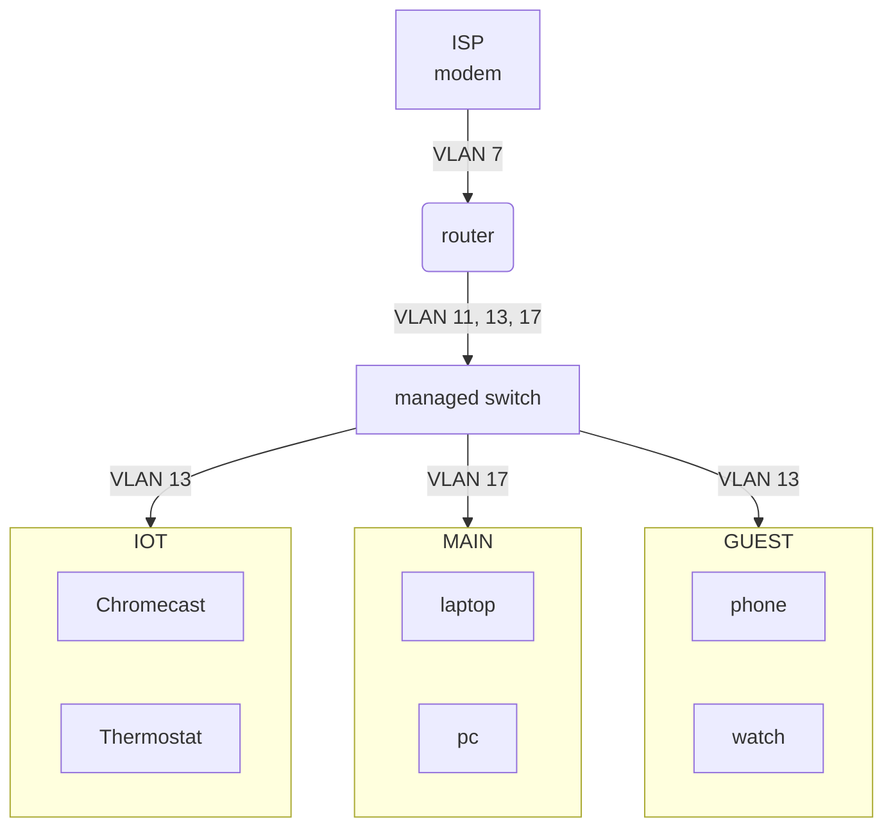

Home network
===
This project contains the OpenWRT configuration files to setup a home network
with three subnets:

 - IoT: for smart home devices like Chromecast
 - Main: for trusted devices like laptops
 - Guest: to provide internet, through a VPN, to guest devices

This is a simplification of how those should work:


## Using it

This is built using [Vaal][vaal], so make sure you have it installed. You will
also need to create a `config.secrets.yaml`, with the same structure as
[config.yaml](./config.yaml), but replacing the values with your real secrets.
Don't commit that file!

After changing the secrets properly you can run:
```bash
vaal sync
```
and restart your router.

## Playground

Inside the playground directory you'll find the [play](./playground/play) script
that can create a virtual network, using VirtualBox, and all necessary hosts to
test your changes to OpenWRT configuration files.
Check the [playground Vaal config file](./playground/config.yaml) and adjust, if
necessary, VirtualBox subnet addresses (192.168.56.*) and network device
(vboxnet0).

To first create all hosts and network run
```bash
playground/play vm create-all
```

You'll need VirtualBox, bash and docker installed on you computer. Beware that
this may take a while since it will build OpenWRT multiple times.
Also, run
```bash
playground/play --help
```
to see all commands available.

[vaal]: https://github.com/m00qek/vaal
